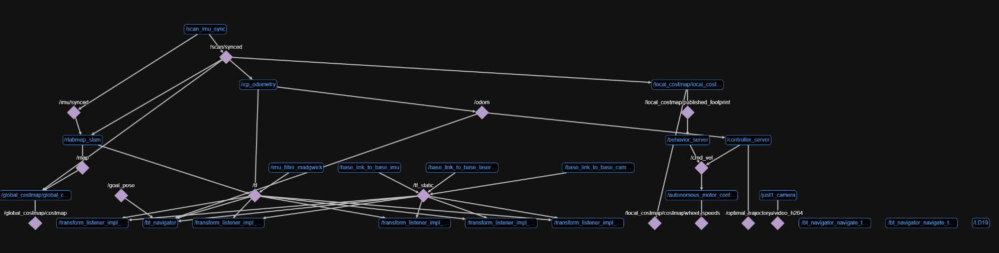

# Just1 ROS2 Node Description

This document provides a comprehensive description of each ROS2 node in the Just1 robot project, their roles, functionality, and communication patterns.

Here is a map of the main nodes and main topics taken from Foxglove while in autonomy.  
  


## Motor Control Nodes

### 1. Manual Motor Controller Node (`manual_controller_node.py`)
**Package:** `just1_motors`  
**Node Name:** `manual_controller_node`

**Role:** Controls the robot's motors using joystick input for manual operation.

**Functionality:**
- Subscribes to joystick data and converts it to wheel speed commands
- Implements dual-stick control system:
  - **Left Stick:** Controls forward/backward movement and turning (priority)
  - **Right Stick:** Controls spinning and lateral movement (when left stick is in deadzone)
- Applies deadzone (0.1) to prevent unwanted movement when controller is centered
- Calculates individual wheel speeds for mecanum drive system
- Directly controls motor hardware via GPIO

**Topics:**
- **Subscribes to:** `joy` (sensor_msgs/Joy) - **100Hz**
- **Publishes to:** `wheel_speeds` (just1_interface/WheelSpeeds) - **100Hz** (same as joystick input)

**Message Structure (WheelSpeeds):**
```yaml
float32 front_left    # Front left wheel speed (-100 to 100)
float32 front_right   # Front right wheel speed (-100 to 100)
float32 back_left     # Back left wheel speed (-100 to 100)
float32 back_right    # Back right wheel speed (-100 to 100)
```

---

### 2. Autonomous Motor Controller Node (`autonomous_controller_node.py`)
**Package:** `just1_motors`  
**Node Name:** `autonomous_motor_controller`

**Role:** Controls the robot's motors using autonomous navigation commands.

**Functionality:**
- Subscribes to velocity commands from navigation system
- Converts linear and angular velocities to wheel speeds using mecanum drive kinematics
- Converts wheel linear speeds to RPM internally, then to signed percent (-100 to 100) for both motor PWM and the `wheel_speeds` topic (same semantics as the manual controller)

**Topics:**
- **Subscribes to:** `cmd_vel` (geometry_msgs/Twist) - **Variable** (depends on navigation system)
- **Publishes to:** `wheel_speeds` (just1_interface/WheelSpeeds) - **Variable** (same as cmd_vel input); message fields are percent -100 to 100, not RPM

---

## Input Device Nodes

### 4. Joystick Driver Node (`joystick_node.py`)
**Package:** `just1_joystick_driver`  
**Node Name:** `joystick_driver`

**Role:** Interfaces with game controllers and joysticks to provide input data.

**Functionality:**
- Uses Pygame to detect and interface with connected controllers
- Supports multiple controller types (Nintendo Pro Controller, etc.)
- Reads all axes and buttons from the controller
- Publishes controller data at 100Hz (10ms intervals)
- Provides controller information logging (name, ID, connection status)

**Topics:**
- **Subscribes to:** None (direct hardware input)
- **Publishes to:** `joy` (sensor_msgs/Joy) - **100Hz**

**Message Structure (Joy):**
```yaml
std_msgs/Header header:
  time stamp
  string frame_id
float32[] axes        # Array of axis values (-1.0 to 1.0)
int32[] buttons       # Array of button states (0 or 1)
```

---

## Sensor Nodes

### 5. Camera Node (`camera_node.py`)
**Package:** `just1_camera`  
**Node Name:** `camera_node`

**Role:** Captures and publishes video feed from the Raspberry Pi camera.

**Functionality:**
- Uses Picamera2 library for optimized camera performance
- Captures frames at 640x480 resolution, 30 FPS
- Encodes video stream using H.264 compression
- Configures camera for low latency (disables noise reduction)
- Publishes compressed video data for efficient transmission

**Topics:**
- **Subscribes to:** None (direct camera input)
- **Publishes to:** `camera/video_h264` (foxglove_msgs/CompressedVideo) - **30Hz**

**Message Structure (CompressedVideo):**
```yaml
builtin_interfaces/Time timestamp
string format         # Compression format (e.g., "h264")
uint8[] data          # Compressed video data
```

---

### 6. IMU Node (`imu_node.py`)
**Package:** `just1_imu`  
**Node Name:** `mpu6050_publisher`

**Role:** Reads and publishes data from the MPU6050 IMU sensor.

**Functionality:**
- Interfaces with MPU6050 via I2C bus
- Provides configurable parameters:
  - I2C bus number
  - Publish rate (default: 10Hz)
  - Calibration samples (default: 100)
  - Gyroscope range (250-2000°/s)
  - Accelerometer range (2-16g)
- Performs automatic calibration on startup
- Applies deadzone filtering to reduce noise
- Converts raw sensor data to SI units (m/s², rad/s)

**Topics:**
- **Subscribes to:** None (direct I2C communication)
- **Publishes to:** `imu/data_raw` (sensor_msgs/Imu) - **10Hz** (configurable)

**Message Structure (Imu):**
```yaml
std_msgs/Header header:
  time stamp
  string frame_id
geometry_msgs/Quaternion orientation:
  float64 x, y, z, w
float64[9] orientation_covariance
geometry_msgs/Vector3 angular_velocity:
  float64 x, y, z    # Angular velocity in rad/s
float64[9] angular_velocity_covariance
geometry_msgs/Vector3 linear_acceleration:
  float64 x, y, z    # Linear acceleration in m/s²
float64[9] linear_acceleration_covariance
```

---

### 7. LiDAR Node

**Package:** `ldlidar_stl_ros2`  
**Node Name:** `LD19`  
**Source:** [`Constructor`](https://github.com/ldrobotSensorTeam/ldlidar_stl_ros2)

**Role:**  
Interfaces with LD19 (and LD06) LiDAR sensors to provide laser scan data to ROS 2.


**Functionality:**
- Supports LD06 and LD19 LiDAR models
- Configurable parameters:
  - Serial port and baudrate
  - Frame ID and topic name
  - Scan direction (clockwise/counterclockwise)
  - Angle cropping for specific field of view
- Converts raw LiDAR data to LaserScan messages
- Provides 360° coverage with configurable range (0.02-12m)
- Runs at 10Hz update rate
- **Captures 500 points per scan** (5000 Hz measurement frequency ÷ 10 Hz scan rate)
- **Angular resolution: 0.72°** between measurement points (360° ÷ 500 points)

**Topics:**
- **Subscribes to:** None (direct serial communication)
- **Publishes to:** `scan` (sensor_msgs/LaserScan) - **10Hz** (fixed by hardware)

**Message Structure (LaserScan):**
```yaml
std_msgs/Header header:
  time stamp
  string frame_id
float32 angle_min          # Start angle of scan (rad)
float32 angle_max          # End angle of scan (rad)
float32 angle_increment    # Angular distance between measurements (rad)
float32 time_increment     # Time between measurements (s)
float32 scan_time          # Time between scans (s)
float32 range_min          # Minimum range value (m)
float32 range_max          # Maximum range value (m)
float32[] ranges           # Range data (m)
float32[] intensities      # Intensity data
```

---

## Processing Nodes

### 8. IMU Filter Node (Madgwick)
**Package:** `imu_filter_madgwick`  
**Node Name:** `imu_filter_madgwick`

**Role:** Filters and fuses IMU data to provide orientation estimates.

**Functionality:**
- Applies Madgwick filter algorithm to raw IMU data
- Fuses accelerometer and gyroscope data
- Provides orientation quaternions
- Configurable gain and zeta parameters
- Optimized for real-time performance

**Topics:**
- **Subscribes to:** `imu/data_raw` (sensor_msgs/Imu) - **10Hz**
- **Publishes to:** `imu/data` (sensor_msgs/Imu) - **10Hz**

---

### 9. Scan-IMU Synchronization Node (`scan_imu_sync.py`)
**Package:** `just1_imu`  
**Node Name:** `scan_imu_sync`

**Role:** Synchronizes LiDAR scan data with IMU data for accurate odometry.

**Functionality:**
- Aligns timestamps between scan and IMU data
- Ensures temporal consistency for SLAM algorithms
- Provides synchronized data streams for navigation

**Topics:**
- **Subscribes to:** 
  - `/scan` (sensor_msgs/LaserScan) - **10Hz**
  - `/imu/data` (sensor_msgs/Imu) - **10Hz**
- **Publishes to:**
  - `/scan/synced` (sensor_msgs/LaserScan) - **10Hz**
  - `/imu/synced` (sensor_msgs/Imu) - **10Hz**

---

### 10. ICP Odometry Node
**Package:** `rtabmap_odom`  
**Node Name:** `icp_odometry`

**Role:** Computes robot odometry using Iterative Closest Point algorithm. Be able to locate the robot's position and orientation compared to its starting point.  
Allows to have the Transform tree between base_link and odom. 

**Functionality:**
- Uses LiDAR scan data and IMU for pose estimation. Could be improved with wheel encoders.
- Implements ICP algorithm for scan matching
- Provides 2D odometry estimates
- Configurable parameters for scan matching thresholds
- Publishes transform from odom to base_link frames

**Topics:**
- **Subscribes to:**
  - `/scan/synced` (sensor_msgs/LaserScan) - **10Hz**
  - `/imu/synced` (sensor_msgs/Imu) - **10Hz**
- **Publishes to:** `odom` (nav_msgs/Odometry) - **Should be 10Hz but around 8Hz with computation**

**Message Structure (Odometry):**
```yaml
std_msgs/Header header:
  time stamp
  string frame_id
string child_frame_id
geometry_msgs/PoseWithCovariance pose:
  geometry_msgs/Pose pose:
    geometry_msgs/Point position:
      float64 x, y, z
    geometry_msgs/Quaternion orientation:
      float64 x, y, z, w
  float64[36] covariance
geometry_msgs/TwistWithCovariance twist:
  geometry_msgs/Twist twist:
    geometry_msgs/Vector3 linear:
      float64 x, y, z
    geometry_msgs/Vector3 angular:
      float64 x, y, z
  float64[36] covariance
```
Covariance represent the uncertainty in the metrics. 


---

### 11. RTAB-Map SLAM Node
**Package:** `rtabmap_slam`  
**Node Name:** `rtabmap_slam`

**Role:** Performs Simultaneous Localization and Mapping (SLAM). Be able to locate the robot in a global map.  
Allows to have the Transform tree between odom and map. 

**Functionality:**
- Creates and maintains occupancy grid maps
- Performs loop closure detection
- Provides global localization
- Integrates scan and IMU data for accurate mapping
- Supports map saving and loading

**Topics:**
- **Subscribes to:**
  - `/scan/synced` (sensor_msgs/LaserScan) - **10Hz**
  - `/imu/synced` (sensor_msgs/Imu) - **10Hz**
- **Publishes to:** `map` (nav_msgs/OccupancyGrid) - **Variable** (updates when map changes)

**Message Structure (OccupancyGrid):**
```yaml
std_msgs/Header header:
  time stamp
  string frame_id
nav_msgs/MapMetaData info:
  time map_load_time
  float32 resolution      # Meters per pixel
  uint32 width           # Map width in pixels
  uint32 height          # Map height in pixels
  geometry_msgs/Pose origin:
    geometry_msgs/Point position:
      float64 x, y, z
    geometry_msgs/Quaternion orientation:
      float64 x, y, z, w
int8[] data              # Occupancy data (-1=unknown, 0=free, 100=occupied)
```

---

## Navigation Nodes (Nav2)

### Nav2 Architecture Overview

Nav2 (Navigation2) is a modular navigation framework that provides autonomous navigation capabilities for mobile robots.  
Great doc: https://docs.nav2.org/concepts/index.html

**Core Navigation Flow:**
1. **Goal Request** → Behavior Tree Navigator receives navigation goal
2. **Global Planning** → Planner Server computes path from current position to goal
3. **Local Control** → Controller Server follows path while avoiding obstacles
4. **Recovery** → Behavior Server handles stuck situations and failures

**Key Components and Relationships:**

- **Behavior Tree Navigator**: The main orchestrator that manages the entire navigation process using behavior trees. It coordinates between all other components and handles the navigation state machine.

- **Planner Server**: Computes global paths using the occupancy grid map. It finds collision-free (or at least minimal cost) routes from the robot's current position to the goal location.

- **Controller Server**: Converts global paths into velocity commands. It handles local path following, obstacle avoidance, and dynamic replanning when obstacles appear.

- **Behavior Server**: Provides recovery behaviors when the robot gets stuck or encounters navigation failures (e.g., spinning in place, backing up, waiting).

- **Lifecycle Manager**: Ensures all Nav2 components start and stop in the correct order, managing their lifecycle states.


**Behavior Tree Logic:**
The behavior tree manages navigation states and recovery:
- **NavigateToPose**: Main navigation behavior
- **ComputePathToPose**: Calls planner server for global path
- **FollowPath**: Calls controller server to follow the path
- **Recovery Behaviors**: Spin, backup, or wait when stuck
- **Condition Checks**: Monitor for goal completion, failures, or replanning needs

A few other components can be used: waypoint follower, speed limits etc.  

---

### 12. Lifecycle Manager
**Package:** `nav2_lifecycle_manager`  
**Node Name:** `lifecycle_manager_navigation`

**Role:** Manages the lifecycle of all Nav2 nodes.

**Functionality:**
- Starts and stops navigation nodes in correct order
- Handles node state transitions
- Ensures proper initialization sequence

---

### 13. Planner Server
**Package:** `nav2_planner`  
**Node Name:** `planner_server`

**Role:** Computes global paths from current position to goal.

**Functionality:**
- Uses occupancy grid map for path planning
- Implements various planning algorithms
- Provides collision-free paths
- Handles goal requests from navigation clients

**Topics:**
- **Subscribes to:** `map` (nav_msgs/OccupancyGrid) - **Variable**
- **Publishes to:** `global_plan` (nav_msgs/Path) - **On demand** (when path planning requested)

---

### 14. Controller Server
**Package:** `nav2_controller`  
**Node Name:** `controller_server`

**Role:** Converts global paths to velocity commands.

**Functionality:**
- Follows global path while avoiding obstacles
- Implements local path planning
- Provides velocity commands for motor control
- Handles dynamic obstacle avoidance

**Topics:**
- **Subscribes to:**
  - `scan` (sensor_msgs/LaserScan) - **10Hz**
  - `odom` (nav_msgs/Odometry) - **10Hz**
  - `global_plan` (nav_msgs/Path) - **On demand**
- **Publishes to:** `cmd_vel` (geometry_msgs/Twist) - **10Hz**

---

### 15. Behavior Tree Navigator
**Package:** `nav2_bt_navigator`  
**Node Name:** `bt_navigator`

**Role:** Orchestrates navigation behaviors using behavior trees.

**Functionality:**
- Manages navigation state machine
- Handles goal requests and cancellations
- Coordinates between planning and control
- Implements recovery behaviors

**Topics:**
- **Subscribes to:** Various navigation topics - **Variable**
- **Publishes to:** Navigation action goals and results - **On demand**

---

### 16. Behavior Server
**Package:** `nav2_behaviors`  
**Node Name:** `behavior_server`

**Role:** Implements specific navigation behaviors.

**Functionality:**
- Provides recovery behaviors (spin, backup, etc.)
- Handles stuck situations
- Implements safety behaviors

---

## Diagnostic Nodes

### 17. Diagnostics Node (`diagnostics_node.py`)
**Package:** `just1_diagnostics`  
**Node Name:** `diagnostics_node`

**Role:** Provides testing and diagnostic capabilities for the robot.

**Functionality:**
- Tests individual wheels and movements
- Validates joystick input
- Provides comprehensive movement testing:
  - Forward, backward, left, right
  - Diagonal movements
  - Spinning (clockwise/counterclockwise)
  - Curved movements
  - Complex patterns (square, lateral arc)
- Configurable test parameters and speeds

**Topics:**
- **Subscribes to:** `joy` (sensor_msgs/Joy) - **10Hz** (for joystick testing)
- **Publishes to:** None (direct motor control)

---

## Utility Nodes

### 18. Foxglove Bridge Node
**Package:** `foxglove_bridge`  
**Node Name:** `foxglove_bridge`

**Role:** Provides web-based visualization and monitoring interface.

**Functionality:**
- Bridges ROS2 topics to web interface
- Enables remote monitoring and control
- Provides real-time data visualization
- Runs on port 8765 by default

**Topics:**
- **Subscribes to:** All ROS2 topics (configurable) - **Variable**
- **Publishes to:** Web interface - **Variable** (bridges all subscribed topics)

---

### 19. Static Transform Publishers
**Package:** `tf2_ros`  
**Node Names:** `base_link_to_base_imu`, `base_link_to_base_laser_ld19`

**Role:** Define fixed spatial relationships between robot components.

**Functionality:**
- **IMU Transform:** 7cm forward, 180° rotation around Z-axis (base_link → imu_link)
- **LiDAR Transform:** 12cm up, 90° rotation around Z-axis (base_link → base_laser)
- Provides coordinate frame definitions for sensor fusion

## Operation Modes

The Just1 robot supports three main operation modes:

1. **Manual Mode:** Joystick control with camera feed
2. **Autonomous Mode:** Full navigation stack with SLAM
3. **Diagnostics Mode:** Testing and validation tools

Each mode activates different subsets of nodes based on the required functionality.
