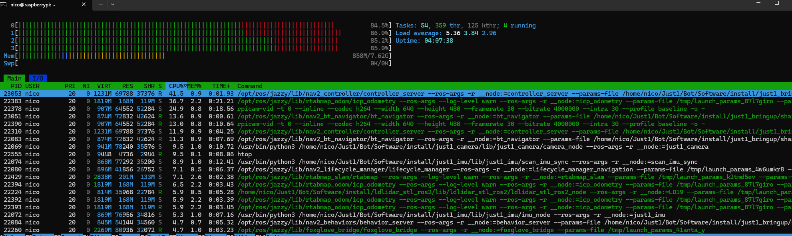

# Just1 Software

Instructions to set up the robot from a raw SD card to autonomous navigation.

## Installation

1. **Install Ubuntu Server 24.04 on your Pi**
   - See `How_to/How_to_Install_Ubuntu_on_Pi.md`
   - Connect via SSH to your Pi, then continue

2. **Install ROS2 on your Pi**
   - See `How_to/How_to_Install_ROS2_on_Pi.md`
   - Note: Do not use a virtual environment (causes issues with Camera and ROS2)

3. **Install git and clone this repository on your Pi**
```bash
sudo apt install git -y
git clone https://github.com/NRdrgz/Just1.git
cd Just1/Bot/Software
```

4. **Install Dependencies**
```bash
sudo apt install python3-pip python3-gpiozero python3-pygame libcap-dev ninja-build libyaml-dev python3-yaml python3-ply python3-jinja2 meson ros-jazzy-foxglove-bridge ros-jazzy-foxglove-msgs python3-smbus i2c-tools ros-jazzy-rtabmap-ros ros-jazzy-imu-filter-madgwick ros-jazzy-navigation2 ros-jazzy-nav2-bringup
sudo pip install --break-system-packages -r requirements.txt
```

5. **Build libcamera from source**
   - libcamera is not available on Ubuntu Server 24.04 (as of July 2025)
```bash
cd ~
git clone https://git.libcamera.org/libcamera/libcamera.git
cd libcamera
meson setup build
sudo ninja -C build install
```
   Add directory to Python search path:
```bash
echo 'export PYTHONPATH=/usr/local/lib/python3/dist-packages:$PYTHONPATH' >> ~/.bashrc
source ~/.bashrc
```

And libcamera-apps
```bash
cd ~
git clone https://github.com/raspberrypi/libcamera-apps.git
cd libcamera-apps
meson setup build
sudo ninja -C build install
```
   Add directory to Python search path:
```bash
echo 'export PYTHONPATH=/usr/local/lib/aarch64-linux-gnu/dist-packages:$PYTHONPATH' >> ~/.bashrc
source ~/.bashrc
echo "/usr/local/lib/aarch64-linux-gnu" | sudo tee /etc/ld.so.conf.d/libcamera.conf
sudo ldconfig
```

6. **Connect Nintendo Pro Controller (optional)**
   - See `How_to/How_to_Connect_Nintendo_Pro_Controller.md`

7. **Build ROS2 packages**
```bash
cd ~/Just1/Bot/Software
colcon build --symlink-install
```

When working on developing the robot, to build a single package you can do <br>
```bash
colcon build --packages-select <package_name> --symlink-install
```

8. **Source workspace**
```bash
source install/setup.bash
```

## Manual Control

At this point, you can control the robot manually.  
To start the manual control system:

```bash
ros2 launch just1_bringup just1.launch.py mode:=manual
```

If you have connected your controller earlier, you should be able to control the robot manually.

## Autonomous Control

Start autonomous navigation:

```bash
ros2 launch just1_bringup just1.launch.py mode:=autonomous
```

You'll need to use Foxglove to visualize the map and provide a goal to the robot.

## Using Foxglove

The `foxglove_bridge_node` used in `just1_bringup` selects the relevant topics to whitelist for Foxglove.

There are many tutorials available online on how to use Foxglove. It is a powerful tool that allows you to visualize logs, send messages on topics, use ROS2 services, and more.  
We'll focus here on the minimum setup needed to have camera feedback, a map of the surroundings, and the ability to give goals to the robot.

### Setup

1. **Download Foxglove** from https://foxglove.dev/
2. **Open a new connection** > WebSocket connection > Input `ws://raspberrypi:8765` (if you followed `Reads/How_to_Install_Ubuntu_on_Pi.md` and set the hostname as `raspberrypi.local`)
3. **Add panels** to visualize your data

### Required Panels

#### Image Panel
- Add an **Image Panel**
- In the panel settings, select the `/camera/video_h264` topic

#### 3D Map Panel
- Add a **3D Map Panel**
- In the panel settings, configure:
  - **Frame** > Display Frame > `map`
  - **Transform** > Hide all except `base_link` or `odom`
  - **Topics** > Visualize all except `/camera/video_h264`
  - **Publish** > 2D pose topic should be `/goal_pose`

### Navigation
- In the top right corner of the map, right-click on the icon below the ruler > **Publish 2D pose**
- Click on the map to set a goal
- The robot should navigate autonomously to the point while avoiding obstacles!

## Performance Notes

Here is a screenshot of `htop` running while the robot is navigating autonomously:



We can see that CPU usage is near 100%, with Nav2 and RTAB-Map at the top.  
The camera node consumes a significant amount of CPU resources. Moving from JPEG to H.264 encoding definitely improved performance, but it can probably be optimized further by implementing it in C++.
The camera node can eventually be deactivated as it is not strictly required for navigation.


```
 ______  __  __  ______  __  __  __  __      __    __  _____   __  __     
/\__  _\/\ \/\ \/\  _  \/\ \/\ \/\ \/\ \    /\ \  /\ \/\  __`\/\ \/\ \    
\/_/\ \/\ \ \_\ \ \ \L\ \ \ `\\ \ \ \/'/'   \ `\`\\/'/\ \ \/\ \ \ \ \ \   
   \ \ \ \ \  _  \ \  __ \ \ , ` \ \ , <     `\ `\ /'  \ \ \ \ \ \ \ \ \  
    \ \ \ \ \ \ \ \ \ \/\ \ \ \`\ \ \ \\`\     `\ \ \   \ \ \_\ \ \ \_\ \ 
     \ \_\ \ \_\ \_\ \_\ \_\ \_\ \_\ \_\ \_\     \ \_\   \ \_____\ \_____\
      \/_/  \/_/\/_/\/_/\/_/\/_/\/_/\/_/\/_/      \/_/    \/_____/\/_____/     
```                               