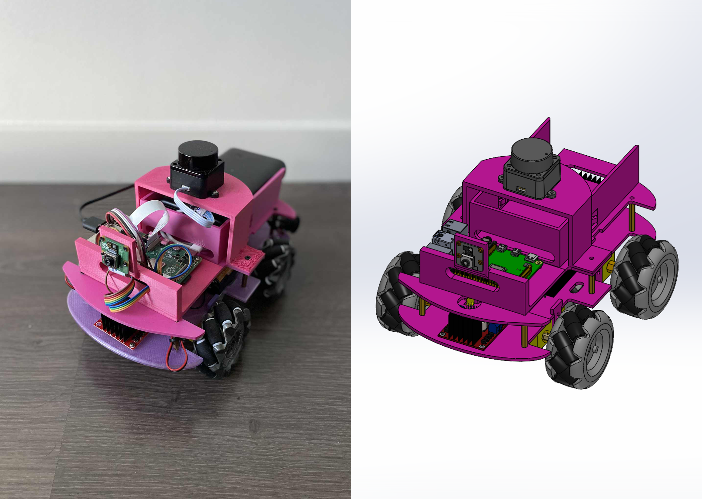
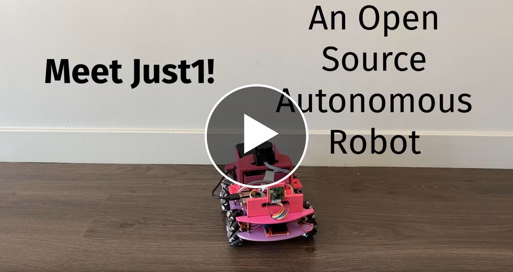

# Just1 - An Open-Source Autonomous Mecanum Wheel Robot

# Watch the Demo!

 
  
Just1 is an open-source robotics platform designed for learning and experimentation.  
It can navigate manually or autonomously, follow a path, avoid obstacles.  

Its hardware stack is composed of:

- Raspberry Pi 4
- Mecanum wheels
- TT motors
- 2D Lidar
- Rasberry Pi Camera
- IMU

Its software stack is composed of:

- ROS2 Jazzy for middleware
- Madgwick filter for IMU
- RTAB-Map for SLAM and odometry
- Nav2 for navigation
- Foxglove for sensor feedback and overall monitoring

Complete build cost: just $250.

Just1 operates in two modes: autonomous navigation with Lidar-based obstacle avoidance, or manual control via gamepad.  
Originally designed for camera-only VSLAM navigation, Just1 now uses Lidar for more reliable obstacle detection and easier software development. Future versions will integrate both camera and Lidar for enhanced autonomous navigation.  
One limit of the current architecture is that obstacles below 20cm are not detected due to the Lidar's position.

Here are some performance highlights (tested on a flat indoor surface):
- Maximum forward speed: 0.6 m/s
- Maximum sideways (lateral) speed: 0.5 m/s
- Maximum rotational speed: 3.5 rad/s (204°/s)
- Operates reliably in complete darkness thanks to its Lidar

## Project Goals

Just1 was created with these objectives in mind:
- Create an affordable, well-documented platform for robotics learning and experimentation
- Develop practical robotics skills, both in hardware and software
- Share knowledge and encourage others to build their own robots

## Workspace Organization

### Hardware
Located in `/Bot/Hardware`:
- Bill of Materials (BoM)
- CAD design files
- Wiring diagrams

### Software
Located in `/Bot/Software`:
- ROS2 packages
- Installation guides
- Manual and autonomous control documentation

## Current Features

- Complete hardware design with BoM and CAD files
- Comprehensive software documentation for Raspberry Pi setup and ROS2 installation
- Manual control using Nintendo controller
- Autonomous navigation using SLAM and Nav2
- Sensor feedback accessible via Foxglove

## Long-term Goals and Potential Improvements

- Add a Docker image for easier and faster deployment
- Replace AA batteries with voltage booster for simplified power management
- Add a bunch of unit tests 
- Add support for carrying the SO-101 robotic arm
- Add wheel encoders to improve ICP odometry
- Add an explorer node to automatically explorer and discover the frontiers of the map
- Use camera in combination with the Lidar for autonomous navigation and obstacle avoidance
- Create a simulation environment in NVIDIA Isaac Sim with Just1 replica for training navigation algorithms before hardware deployment
- Integrate memory/latency profilers to optimize processes and detect memory leaks
- Perform navigation through end-to-end neural network architecture instead of VSLAM 

